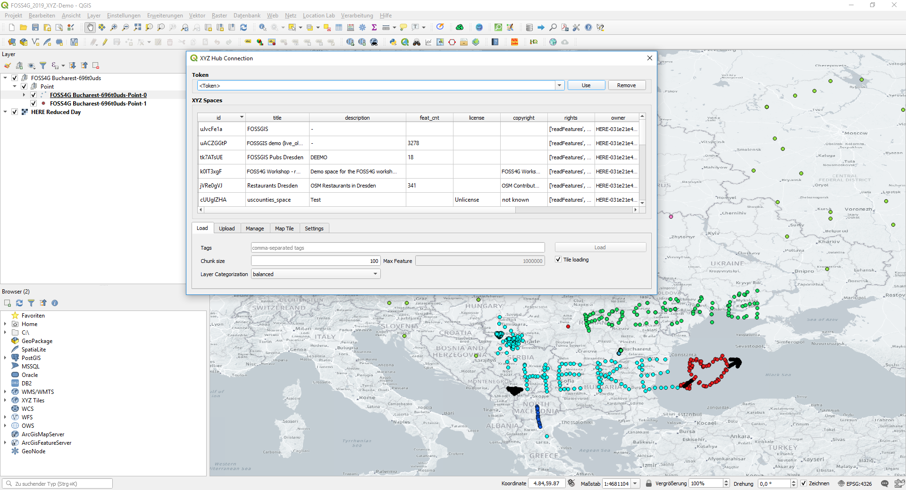

# XYZ Hub Connector - QGIS plugin

XYZ Hub Connector is a [QGIS](https://www.qgis.org) plugin that allows users to connect and to update data directly into [HERE XYZ Hub](https://www.here.xyz/). QGIS users can easily and quickly publish their work and analysis in vectorized format to the XYZ platform. Public and personal XYZ space data can be loaded into QGIS for further analysis and visualization.

## Installation

### Prerequisite

* QGIS version 3.0 or later

### Install via custom repository in QGIS

1. In QGIS, navigate to menu **Plugins** > **Manage and Install Plugins...** > **Settings**
2. Scroll down to the **Plugin repositories**, select **Add..**
3. Fill in the following details:

<b>

Name | HERE XYZ Hub Connector
-|-
URL | https://raw.githubusercontent.com/heremaps/xyz-qgis-plugin/master/repo/plugins.xml
Enabled | x

</b>

4. Move to Tab **All**, search for `XYZ Hub Connector`
5. Select `XYZ Hub Connector`, then **Install plugin**

### Install manually from zip file in QGIS

1. Download the [latest release](https://github.com/heremaps/xyz-qgis-plugin/releases) zip file
2. In QGIS, navigate to menu **Plugins** > **Manage and Install Plugins...** > **Install from ZIP**, then select the downloaded zip file.

## Usage

Once you have installed and enabled the plugin XYZ Hub Connector in QGIS, it can be accessed via the toolbar, or the menu **Web**

`New XYZ Hub Connection` : load data from an XYZ space into QGIS, given a valid token and server (PRD/CIT). To learn more about how to generate a token, refer to https://www.here.xyz/api/getting-token/ and https://xyz.api.here.com/token-ui/. 

`Upload to a new XYZ Space` : upload current Vector Layer to a new XYZ Hub space. For this to work, make sure that your token also has write-level permissions.

`Clear cache` : empty the temporary cache folder. Active layers will be invalid after clearing cache.

## Development

1. Clone this repository.
2. Build the plugin by running `sh makeBuild.sh <VERSION NUMBER>`,
e.g. `sh makeBuild.sh 1.5.5`.

## License

Copyright (C) 2019 HERE Europe B.V.

This project is licensed under the MIT license - see the [LICENSE](./LICENSE) file in the root of this project for license details.
